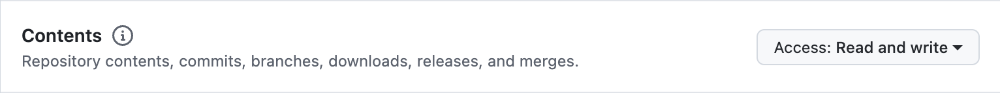

# ZRunner
ZRunner is a data co-processor that helps you index on-chain data on Zettablock platform.

## Pre-requisites
Golang 1.21 or higher

## Concepts
A ZRunner project is composed of the following components:
- `schemas` folder: Contains .sql files that define the schema of the tables you want to index.
- `project.yaml`: Contains the configuration for the ZRunner project.
- multiple `pipeline` folders: Contains the pipeline files that define the indexing logic.
- `dao` folder: Contains the GORM DAO files that interact with the database.

Project structure:
```
project
├── schemas
│   ├── table1.sql
│   └── table2.sql
├── pipeline1
│   ├── pipeline.yaml
│   ├── block_handlers.go
│   └── event_handlers.go
├── pipeline2
│   ├── pipeline.yaml
│   ├── block_handlers.go
│   └── event_handlers.go
├── dao
│   ├── table1.gen.go
│   └── table2.gen.go
├── project.yaml
└── go.mod
```

## Usage
### Create a new ZRunner repo
Create a github repo and clone it to your local machine. If it's a private repo, you also need to create a PAT and grant it the permission `Contents`.



### Install `zetta-go` CLI
```bash
go install github.com/Zettablock/zetta-go@latest
```

### Initialize a zrunner project
You must initialize a zrunner project inside a GitHub repo.
```bash
❯ zetta-go zrunner init
```
`zetta-go` will generate a scaffold for a zrunner project.

The scaffold includes the following files:
```
project
├── schemas
│   ├── example-table.sql
├── example-pipeline
│   ├── pipeline.yaml
│   ├── block_handlers.go
│   └── event_handlers.go
├── project.yaml
└── go.mod
```

### Generate GORM DAO files
`zetta-go` will scan /schemas folder and generate GORM DAO files for each .sql file.
```bash
❯ zetta-go zrunner ormgen
```
Note that currently it does not support `text[]` and `jsonb` types as well as index creation. If you have these types in your schema, you need to first comment them out before running `ormgen`, manually add them to the generated files, and then uncomment them in the schema.

PG and Golang types mapping:
| PG        | Golang         |
| --------- | -------------- |
| text[]    | pq.StringArray |
| jsonb     | []bytes        |
| timestamp | time.Time      |

*We are working on improving this feature.*

### Create a pipeline template
`zetta-go` will generate a pipeline template in /your-pipeline folder.
```bash
❯ zetta-go zrunner pipeline create your-pipeline
```
The pipeline template includes the following files:
```
your-pipeline
├── pipeline.yaml
├── abi.json (if source type is RPC)
├── block_handlers.go
└── event_handlers.go
```
### Deploy the project
`zetta-go` will deploy the pipeline to the hosted zrunner service. `--pat` is required for private GitHub repo.
```bash
❯ zetta-go zrunner deploy --api-key zettablock-api-key [--pat your-github-pat] 
```
## How to write a pipeline
### `project.yaml`
The `project.yaml` file contains the configuration for the ZRunner project. Here is an example:
```yaml
specVersion: 0.0.1 # not used for now
org: zettablock # required, usually this should be company name without space. Only alphanumeric characters and underscores are allowed.
kind: ethereum # chain name
network: sepolia # chain network
version: 1.0.0
name: story-zrunner # required, not space or special chars allowed, must be consistent with the project folder name
githubRepo: "https://github.com/Zettablock/story-zrunner.git"
```
`org` will be schema name in the database. All tables will be created under this schema.
For example, if `org` is `zettablock`, the table `example-table` will be created as `zettablock.example_table`. Please note that the full table name lenght should not exceed 63 characters due to Postgres limitations.

`name` must be consistent with the project folder name.

### `pipeline.yaml`
The `pipeline.yaml` file contains the configuration for the pipeline. Here is an example:
```yaml
name: ip-asset # required, no space or special chars allowed, must be consistent with the pipeline folder name
source:
  startBlock: 5768454
  addresses:
    - "0xd43fE0d865cb5C26b1351d3eAf2E3064BE3276F6"
eventHandlers: # multiple handlers
  - event: IPRegistered
    handler: HandlerIPRegistered # name must match the function name in event_handlers.go
blockHandlers:
  - handler: HandleBlock # name must match the function name in block_handlers.go
```
`name` must be consistent with the pipeline folder name.

`startBlock` is the block number from which the pipeline will start indexing.

You can also use `RPC` as the data source, in this case you need to provide the `RPC` endpoint and the `abi.json` for decoding the events:
```yaml
name: ip-asset # required, no space or special chars allowed, must be consistent with the pipeline folder name
source:
  startBlock: 5768454
  type: rpc
  rpc: "https://your-rpc-endpoint"
  addresses:
    - "0xd43fE0d865cb5C26b1351d3eAf2E3064BE3276F6"
  abiFile: plugins_<project>/<pipeline>/<abi>.json
eventHandlers: # multiple handlers
  - event: IPRegistered
    handler: HandlerIPRegistered # name must match the function name in event_handlers.go
blockHandlers:
  - handler: HandleBlock # name must match the function name in block_handlers.go
```

#### Supported chains
* Database as source: ethereum, beacon, stellar
* RPC as source: ethereum, beacon, base

### schemas
The `schemas` folder contains `.sql` files that define the schema of the tables you want to index. Here is an example:
```sql
CREATE TABLE example_table (
    id SERIAL PRIMARY KEY,
    name TEXT NOT NULL,
    age INT NOT NULL
);
```
It must be  `PostgreSQL` syntax.

You can have multiple `CREATE TABLE` statements in a single `.sql` file.

There are some limitations, you can refer to the [ormgen](#generate-gorm-dao-files) section.

### DAO
The `dao` folder contains the [GORM](https://gorm.io/docs/) files that interact with the database generated by the command `ormgen`. Here is an example for `ip_asset.gen.go`:
```go
package dao

import (
  "github.com/lib/pq"
  "time"
)

const TableNameIPAsset = "ip_asset"

// IPAsset mapped from table <ip_asset>
type IPAsset struct {
	BlockNumber   int64          `gorm:"column:block_number;not null" json:"block_number"`
	BlockTime     int64          `gorm:"column:block_time;not null" json:"block_time"`
	ID            string         `gorm:"column:id;primaryKey" json:"id"`
	IPID          string         `gorm:"column:ip_id" json:"ip_id"`
	ChainID       int64          `gorm:"column:chain_id" json:"chain_id"`
	TokenContract string         `gorm:"column:token_contract" json:"token_contract"`
	TokenID       int64          `gorm:"column:token_id" json:"token_id"`
	Metadata      []byte         `gorm:"type:jsonb;default:'{}';column:metadata" json:"metadata"`
	ChildIPIDs    pq.StringArray `gorm:"type:text[];column:child_ip_ids" json:"child_ip_ids"`
	ParentIPIDs   pq.StringArray `gorm:"type:text[];column:parent_ip_ids" json:"parent_ip_ids"`
	RootIPIDs     pq.StringArray `gorm:"type:text[];column:root_ip_ids" json:"root_ip_ids"`
	NftName       string         `gorm:"column:nft_name" json:"nft_name"`
	NftTokenURI   string         `gorm:"column:nft_token_uri" json:"nft_token_uri"`
	NftImageURL   string         `gorm:"column:nft_image_url" json:"nft_image_url"`
  BlockTime     time.Time `gorm:"column:block_time;not null;type:timestamp" json:"block_time"`
}

// TableName IPAsset's table name
func (*IPAsset) TableName() string {
	return TableNameIPAsset
}
```
You can add custom methods to the struct.

For more information about GORM, please refer to the [GORM documentation](https://gorm.io/docs/).

### block_handlers.go
The `block_handlers.go` file contains the logic for handling blocks. There are 4 types of block handlers:
```go
// blockNumber: block number as int
func(blockNumber int, deps *sourceutils.Deps) (bool, error)

// blockNumber: block number as int64
func(blockNumber int64, deps *sourceutils.Deps) (bool, error)

// blockNumber: block number as string
func(blockNumber string, deps *sourceutils.Deps) (bool, error)

// block: block as ethereum.Block
func(block ethereum.Block, deps *sourceutils.Deps) (bool, error)

// block: block as base.Block
func(block base.Block, deps *sourceutils.Deps) (bool, error)
```

Return:
- `bool`: true if the handler should be retried.
- `error`: if any error or `nil`

Only `ethereum.Block` and `base.Block` are supported for now.

Example:
```go
package main

import (
	"sort"

	"github.com/Zettablock/beaconlambda/dao"
	"github.com/Zettablock/zsource/dao/beacon"
	"github.com/Zettablock/zsource/utils"
)

// HandleWithdrawalsRealtimeByBlock retrieves withdrawals by block number, sorts them by index, add IndexPosition and saves them to the destination database.
func HandleWithdrawalsRealtimeByBlock(blockNumber int64, deps *utils.Deps) (bool, error) {
	var withdrawals []beacon.Withdrawal

  // get withdrawals by block number from the source database
	err := deps.SourceDB.Table(beacon.TableNameWithdrawal).Where("slot_number = ?", blockNumber).Find(&withdrawals).Limit(100).Error
	if err != nil {
		deps.Logger.Error("failed to get withdrawals", "block number", blockNumber, "error", err)
		return false, err

	}

	sortWithdrawalsByIndex(withdrawals)

	withdrawalsRealtime := make([]dao.WithdrawalsEnhancedRealtime, len(withdrawals))
	for i, withdrawal := range withdrawals {
		withdrawalsRealtime[i] = dao.WithdrawalsEnhancedRealtime{
			SlotNumber:     withdrawal.SlotNumber,
			Index:          withdrawal.Index,
			ValidatorIndex: withdrawal.ValidatorIndex,
			IndexPosition:  int32(i),
			Address:        withdrawal.Address,
			Amount:         withdrawal.Amount,
			BlockTime:      withdrawal.BlockTime,
			BlockNumber:    withdrawal.BlockNumber,
			BlockHash:      withdrawal.BlockHash,
			BlockDate:      withdrawal.BlockDate,
		}
	}

	if len(withdrawalsRealtime) == 0 {
		return false, nil
	}

	err = deps.DestinationDB.Table(dao.TableNameWithdrawalsEnhancedRealtime).Save(&withdrawalsRealtime).Error
	if err != nil {
		deps.Logger.Error("failed to save withdrawals enhanced realtime", "block number", blockNumber, "error", err)
		return false, err
	}

	return false, nil
}

func sortWithdrawalsByIndex(withdrawals []beacon.Withdrawal) {
	// sort by index
	sort.Slice(withdrawals, func(i, j int) bool {
		return withdrawals[i].Index < withdrawals[j].Index
	})
}
```

### event_handlers.go
The `event_handlers.go` file contains the logic for handling events. There are 2 types of event handlers:
```go
// log: log as ethereum.Log
func(ethereum.Log, *sourceutils.Deps) (bool, error)

// log: log as base.Log
func(base.Log, *sourceutils.Deps) (bool, error)
```
You need to maunally cast the `log` to the correct event struct. For example:
```go
package main

import (
	"encoding/json"
	"errors"
	"net/http"
	"strconv"

	"story-zrunner-demo/dao"

	"github.com/Zettablock/zsource/dao/ethereum"
	"github.com/Zettablock/zsource/utils"
	"gorm.io/gorm"
)

func HandlerIPRegistered(log ethereum.Log, deps *utils.Deps) (bool, error) {
	blockNumber := log.BlockNumber
	blockTime := log.BlockTime

	chainID, err := strconv.ParseInt(log.ArgumentValues[1], 0, 64)
	if err != nil {
		return false, err
	}

	tokenID, err := strconv.ParseInt(log.ArgumentValues[3], 0, 64)
	if err != nil {
		return false, err
	}

	tokenContract := log.ArgumentValues[2]
	uri := log.ArgumentValues[5]

	ipAsset := &dao.IPAsset{
		BlockNumber:   blockNumber,
		BlockTime:     blockTime.Unix(),
		ID:            log.ArgumentValues[0],
		IPID:          log.ArgumentValues[0],
		ChainID:       chainID,
		TokenContract: tokenContract,
		TokenID:       tokenID,
		Metadata:      nil,
		ChildIPIDs:    nil,
		ParentIPIDs:   nil,
		RootIPIDs:     nil,
		NftName:       log.ArgumentValues[4],
		NftTokenURI:   uri,
		NftImageURL:   "",
	}

	if uri != "" {
		response, err := http.Get(uri)
		if err != nil {
			deps.Logger.Error("Error fetching image", "uri", uri, "error", err)
			return false, err
		}

		if response.StatusCode == 200 {
			jsonResponse := make(map[string]interface{})
			err := json.NewDecoder(response.Body).Decode(&jsonResponse)
			if err != nil {
				deps.Logger.Error("Error decoding response body", "error", err)
				return false, err
			}

			if image, ok := jsonResponse["image"]; ok {
				ipAsset.NftImageURL = image.(string)
			}
		}
	}

	if err := deps.DestinationDB.Save(ipAsset).Error; err != nil {
		return false, err
	}

	collection := &dao.Collection{}
	if err := deps.DestinationDB.Where("id = ?", tokenContract).Take(collection).Error; err != nil && !errors.Is(err, gorm.ErrRecordNotFound) {
		return false, err
	}
	if collection.ID == "" {
		collection = &dao.Collection{
			ID:                    tokenContract,
			AssetCount:            1,
			RaisedDisputeCount:    0,
			CancelledDisputeCount: 0,
			ResolvedDisputeCount:  0,
			JudgedDisputeCount:    0,
			LicensesCount:         0,
		}
	} else {
		collection.AssetCount++
		collection.BlockNumber = blockNumber
		collection.BlockTime = blockTime.Unix()
	}
	if err = deps.DestinationDB.Save(collection).Error; err != nil {
		return false, err
	}

	txn := &ethereum.Transaction{}
	if err = deps.SourceDB.Where("hash = ?", log.TransactionHash).Take(txn).Error; err != nil {
		return false, err
	}

	daoTx := &dao.Transaction{
		BlockNumber:      blockNumber,
		BlockTime:        blockTime.Unix(),
		ID:               log.TransactionHash,
		TxHash:           log.TransactionHash,
		TransactionIndex: log.TransactionIndex,
		LogIndex:         log.LogIndex,
		Initiator:        txn.FromAddress,
		CreatedAt:        blockTime.Unix(),
		ResourceID:       log.ContractAddress,
		IPID:             log.ArgumentValues[1],
		ActionType:       "Register",
		ResourceType:     "IPAsset",
	}

	if err = deps.DestinationDB.Save(daoTx).Error; err != nil {
		return false, err
	}
	return false, nil
}
```

IPRegistered event signature: `IPRegistered (address ipId, index_topic_1 uint256 chainId, index_topic_2 address tokenContract, index_topic_3 uint256 tokenId, string name, string uri, uint256 registrationDate)`. You can access the event arguments using `log.ArgumentValues`.